<h1 align="center">YTB Player</h1>

<p align="center">
  A YouTube client for the Nintendo Switch (homebrew), laid out like YouTube's tablet app.<br>
  Works with the buttons and the touch screen. No ads, no Google sign-in.
</p>

<p align="center">
  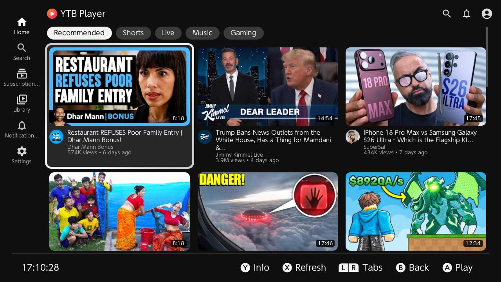
</p>

## Features

- **Home** with YouTube's category chips (recommended, Shorts, live, music, gaming); L and R switch between them.
- **Watch page**: the video's details, its channel, comments with replies and related videos.
- **Shorts**: upright cards and a Shorts player that goes on to the next one (up and down, or a swipe).
- **Channels**: banner, videos, Shorts, live streams and playlists.
- **Subscriptions** (signed in): your feed, with filters for today, videos, live and Shorts.
- **Library**: history and favorites on the SD card; Watch later, Liked videos and your playlists from your account.
- **Notifications** from your account.
- **Player**: up to 1080p docked and 720p handheld, a menu for quality, speed and loop, chapters, subtitles, SponsorBlock, loudness levelling, resume where you left off, autoplay.
- **Sign in over Wi-Fi**: open the address the Switch shows on a computer or phone and send your cookies from there.
- **Touch**: tap to play, hold a card for its page, swipe to scroll.
- **Languages**: English, Turkish and Korean. The app starts in the console's language (English when it has no translation for it); Turkish can be picked in Settings.

## Screenshots

| | |
|:-:|:-:|
| 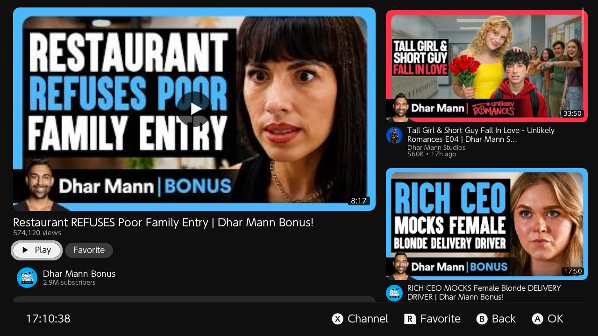 | 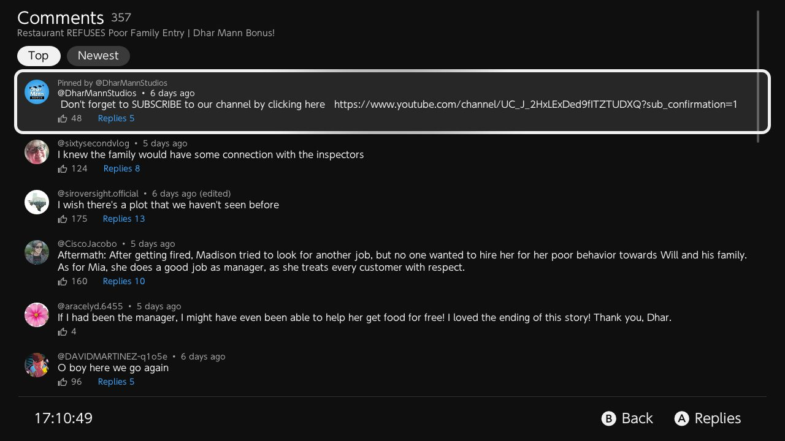 |
| **Watch page** | **Comments** |
| 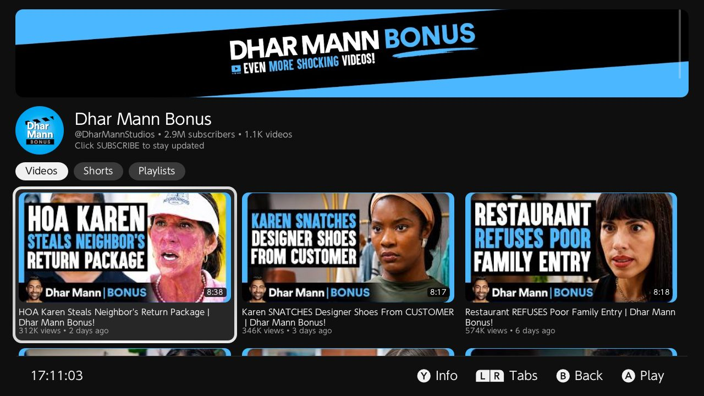 | 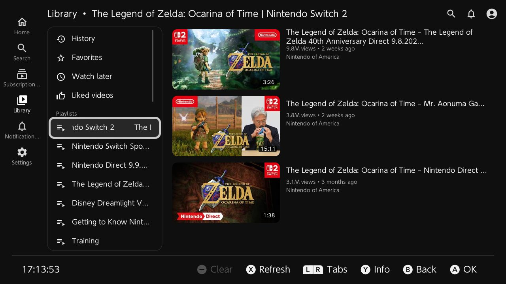 |
| **Channel** | **Playlist** |
| 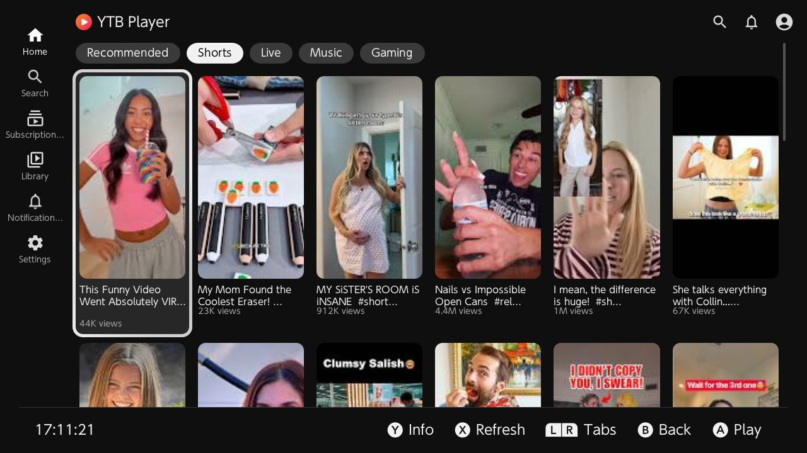 |  |
| **Shorts** | **Shorts player** |
| 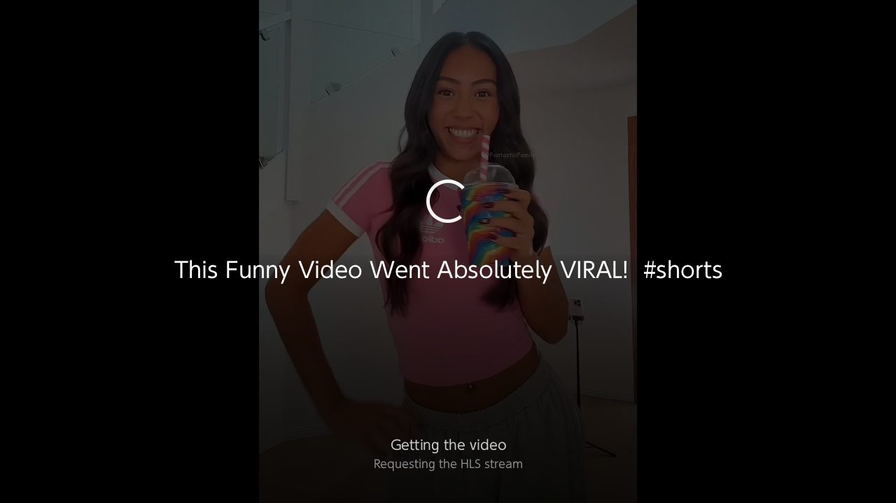 | 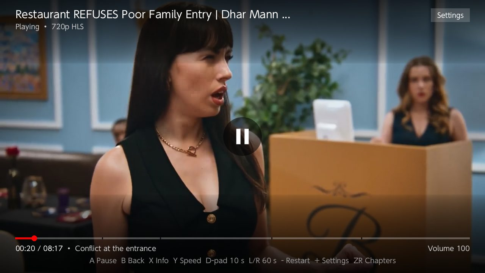 |
| **Opening a video** | **Player** |
| 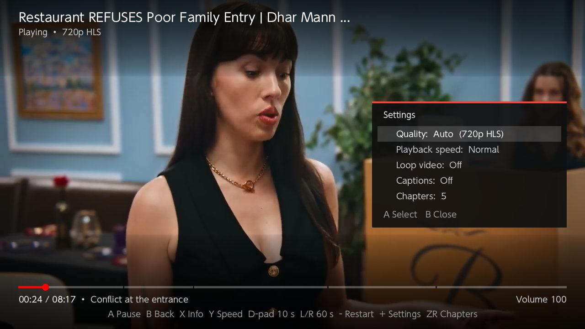 | 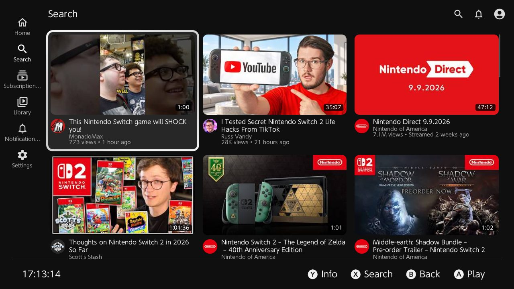 |
| **Player menu** | **Search** |
| 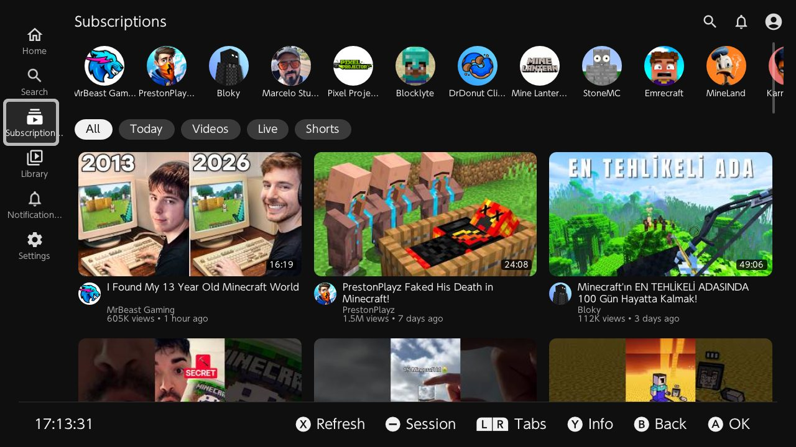 | 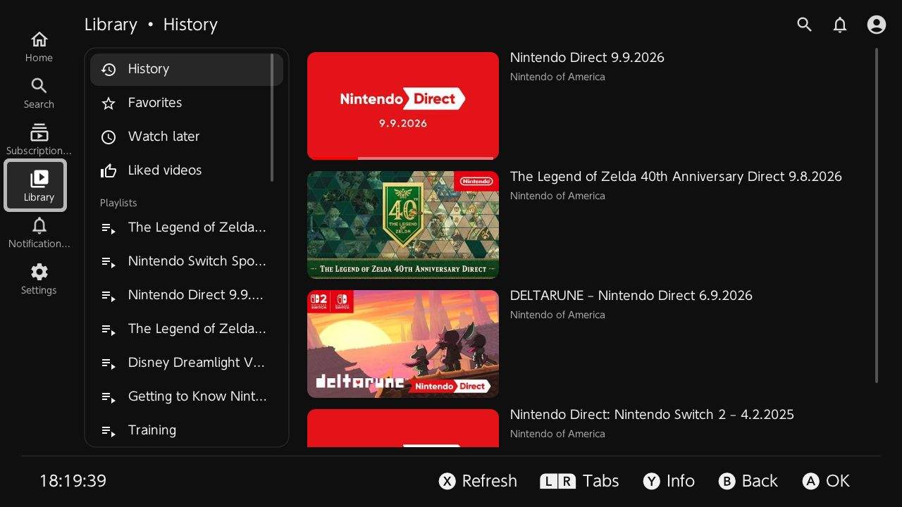 |
| **Subscriptions** | **Library** |
| 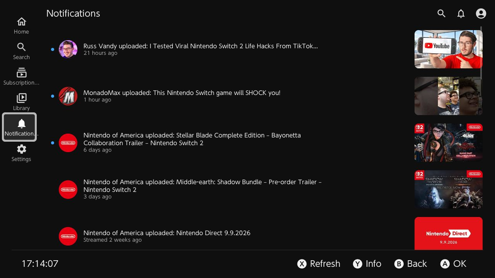 | 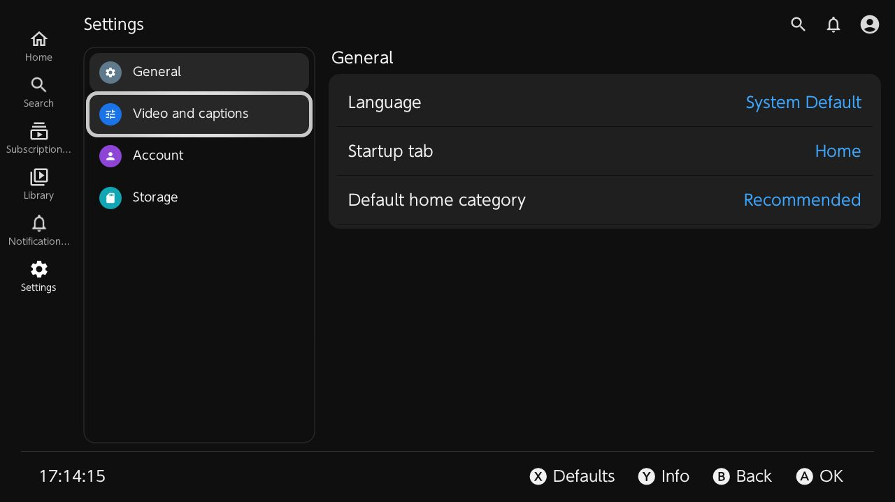 |
| **Notifications** | **Settings** |
| 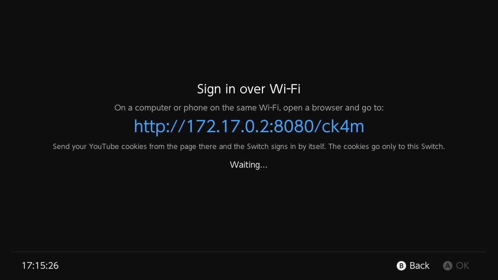 | 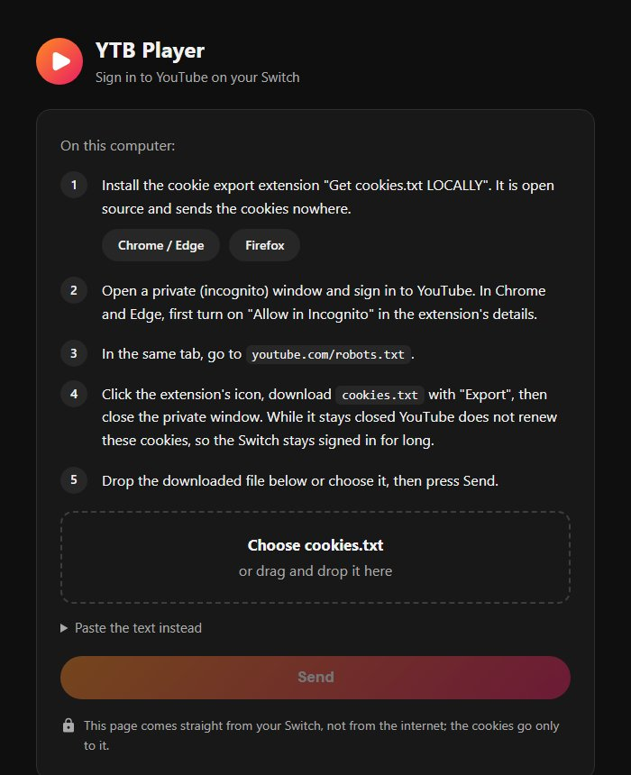 |
| **Sign in over Wi-Fi** | **The page it opens on a computer** |

## Installation

1. The Switch needs custom firmware (Atmosphère) and the Homebrew Menu.
2. Download `ytb-player.nro` from the [latest release](../../releases/latest).
3. Copy it to `sdmc:/switch/ytb-player/ytb-player.nro`.
4. Start it from the Homebrew Menu. Open the Homebrew Menu through a game (hold R while starting one) rather than from the Album, so that the player gets the full memory.

## Controls

| Button | Lists | Player |
|:-:|---|---|
| A | Play | Pause / resume |
| B | Back | Close |
| X | Refresh | Info bar |
| Y | Details (the video's page) | Speed |
| L / R | Previous / next tab | Back / forward 60 s |
| D-pad | Move | ◀ ▶ 10 s, ▲ ▼ volume |
| − | Session (Subscriptions), clear (Library) | Start over |
| + | | Settings: quality, speed, loop |
| ZR | | Chapters |

In the Shorts player ▲ and ▼ go to the previous and next Short.

## Signing in (optional)

There is no Google sign-in; YTB Player uses the YouTube cookies of a browser where you are signed in. Everything except your subscriptions, your lists and notifications works without it.

**Over Wi-Fi (no SD card needed):**

1. In the app, open Subscriptions, press − and choose **Send over Wi-Fi**. The Switch shows an address such as `http://192.168.1.23:8080/k7p3`.
2. Open that address in a browser on a computer (or phone) on the same network.
3. Follow the steps on that page: it links the cookie export extension ("Get cookies.txt LOCALLY"), has you sign in to YouTube in a private window and export `cookies.txt`, and takes the file (drop it or choose it). The Switch signs in by itself.

The page comes from the Switch, not from the internet, and it stops when the screen is closed.

**With a file:** save the cookies as `sdmc:/switch/ytb-player/auth.txt` (a `Cookie` header, JSON `{"cookie_header": "..."}` or Netscape `cookies.txt`), then choose **Load File** in the same menu.

Signed in, you get your subscriptions, a personal Home, Watch later, Liked videos, your playlists and notifications. The cookies stay on the SD card; keep them as private as a password.

## Files

Everything is kept in `sdmc:/switch/ytb-player/`:

| File | Contents |
|---|---|
| `settings.json` | Settings |
| `library.json` | History and favorites |
| `progress.json` | Where each video was left |
| `session.json` | The login session |
| `auth.txt` | Cookies to import (you add it) |
| `ytb-player.log` | Log of the last run |

On its first start YTB Player copies the settings, history and session of Switch-NewPipe (`sdmc:/switch/switch_newpipe_*`) when they are there; Switch-NewPipe keeps its own.

## Building

The Switch build runs in Docker with devkitPro:

```bash
./build.sh             # the first time also builds FFmpeg and mpv for the Switch (slow)
./build.sh --app-only  # later builds
```

The result is `cmake-build-switch/ytb-player.nro`.

For development there is a Linux desktop build and a command-line tool for the YouTube code:

```bash
cmake -B build -DPLATFORM_DESKTOP=ON -DDESKTOP_PLAYER=ON && cmake --build build --target ytb_player
make host && ./build/host/ytb_player_host --search "nintendo"
```

## Credits

YTB Player is a modified version of [Switch-NewPipe](https://github.com/mirusu400/switch-newpipe) by mirusu400. The changes are by muratgokce (2026).

It is built on:

- [borealis](https://github.com/natinusala/borealis) (natinusala, XITRIX, xfangfang): the user interface
- [mpv](https://mpv.io) and [FFmpeg](https://ffmpeg.org): playback
- [QuickJS](https://bellard.org/quickjs/), [lunasvg](https://github.com/sammycage/lunasvg), [nlohmann/json](https://github.com/nlohmann/json), [cpp-httplib](https://github.com/yhirose/cpp-httplib), stb and nanovg
- [Material icons](https://fonts.google.com/icons) by Google
- [SponsorBlock](https://sponsor.ajay.app) for the sponsor segments

## License

GPL-3.0, see [LICENSE.MD](LICENSE.MD). It comes with no warranty.

YTB Player is not affiliated with or endorsed by YouTube, Google or Nintendo. YouTube is a trademark of Google LLC; Nintendo Switch is a trademark of Nintendo.
